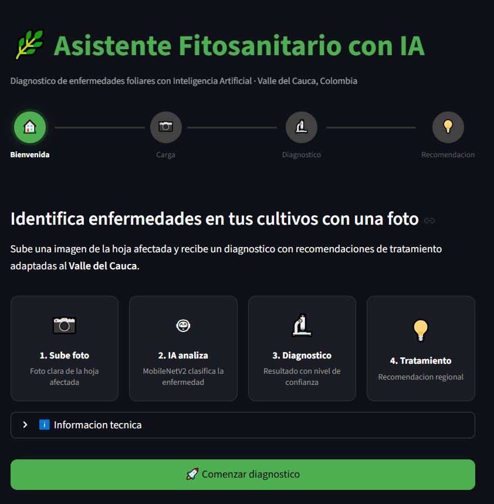
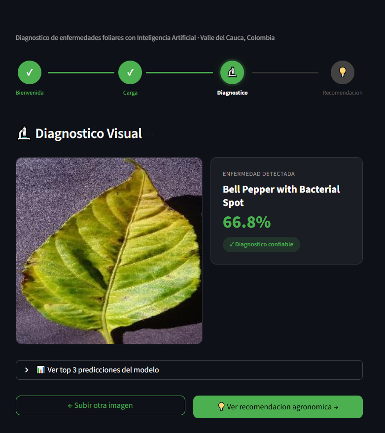
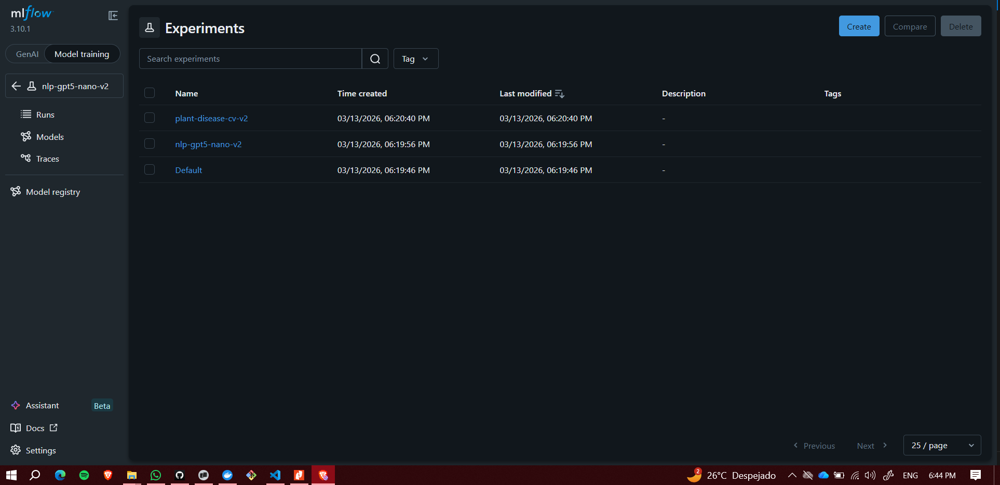
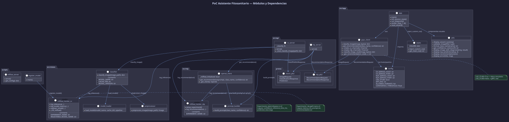
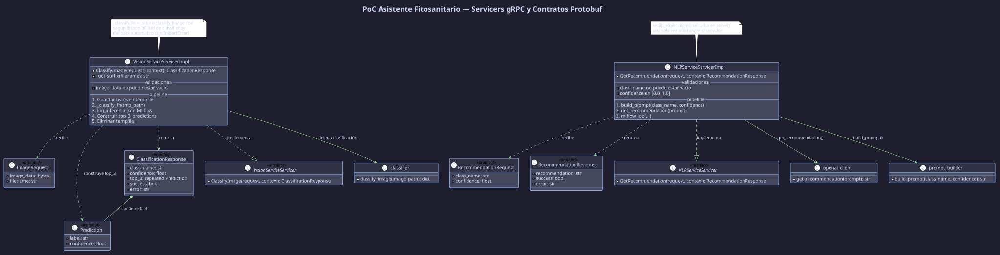

# 🌿 PoC Asistente Fitosanitario con IA


[](https://creativecommons.org/licenses/by-nc/4.0/)

**Prueba de Concepto** — Diagnóstico de enfermedades foliares en cultivos del Valle del Cauca mediante Inteligencia Artificial.

> Proyecto académico · Universidad Autónoma de Occidente · Curso: Desarrollo de Proyectos de IA · 2026

---

## Descripción

Sistema que permite a agricultores del Valle del Cauca (Colombia) diagnosticar enfermedades en sus cultivos a partir de una fotografía de la hoja afectada. El flujo es:

1. El usuario sube una foto de la hoja desde la interfaz web (Streamlit)
2. El servicio de **Visión Computacional** clasifica la enfermedad usando MobileNetV2 entrenado con PlantVillage (~50,000 imágenes, 38 clases, 95.4% accuracy)
3. El servicio de **NLP** genera una recomendación agronómica contextualizada al Valle del Cauca usando GPT-5 Nano
4. **MLflow** registra cada inferencia para trazabilidad de experimentos

La comunicación entre servicios se realiza mediante **gRPC** (Google Remote Procedure Call).

---

## Capturas de Pantalla





---

## Arquitectura

```
┌─────────────┐     gRPC      ┌──────────────────┐
│  Streamlit   │─────────────►│  Servicio CV      │
│  (Frontend)  │              │  MobileNetV2      │
│  :8501       │              │  :50051           │
│              │     gRPC     ├──────────────────┤
│              │─────────────►│  Servicio NLP     │
│              │              │  GPT-5 Nano       │
└─────────────┘              │  :50052           │
                              └────────┬─────────┘
                                       │ MLflow tracking
                              ┌────────▼─────────┐
                              │  MLflow Server    │
                              │  Tracking & UI    │
                              │  :5000            │
                              └──────────────────┘
```

**4 servicios:**

| Servicio | Puerto | Tecnología | Responsabilidad |
|----------|--------|------------|----------------|
| **App (Streamlit)** | 8501 | Streamlit + gRPC client | Interfaz web wizard de 4 pasos |
| **CV Server** | 50051 | gRPC + MobileNetV2 | Clasificación de enfermedades foliares |
| **NLP Server** | 50052 | gRPC + OpenAI GPT-5 Nano | Recomendaciones agronómicas |
| **MLflow** | 5000 | MLflow Tracking Server | Registro de experimentos y métricas |

---
## Diagrama de Clases
## Diagramas de Clases

### Módulos y Dependencias


### Servicers gRPC


## Modelos de IA

### Visión Computacional — MobileNetV2

**Modelo:** [`linkanjarad/mobilenet_v2_1.0_224-plant-disease-identification`](https://huggingface.co/linkanjarad/mobilenet_v2_1.0_224-plant-disease-identification)

#### Arquitectura

MobileNetV2 es una red neuronal convolucional diseñada para entornos con recursos limitados (móviles, servidores básicos). Su característica principal son las **depthwise separable convolutions**: en lugar de aplicar una convolución estándar que opera sobre todos los canales simultáneamente, descompone la operación en dos pasos:

1. **Depthwise convolution** — aplica un filtro independiente por cada canal de entrada.
2. **Pointwise convolution** — combina los resultados con una convolución 1×1.

Esto reduce el costo computacional en un factor de 8–9x respecto a una convolución estándar, con una pérdida mínima de accuracy. Adicionalmente, MobileNetV2 introduce **inverted residuals con linear bottlenecks**: expande la representación en capas intermedias y la comprime al final, permitiendo que los gradientes fluyan mejor durante el entrenamiento.

Para este proyecto, la elección de MobileNetV2 sobre arquitecturas más pesadas (ResNet50, EfficientNet) fue deliberada: el servidor de despliegue en DigitalOcean tiene RAM limitada, y MobileNetV2 pesa ~14 MB y corre eficientemente en CPU sin GPU.

#### Dataset — PlantVillage

| Característica | Detalle |
|---|---|
| **Imágenes totales** | ~54,000 imágenes |
| **Clases** | 38 (enfermedades + plantas sanas de múltiples cultivos) |
| **Cultivos incluidos** | Tomate, papa, maíz, uva, manzana, durazno, fresa, pimiento, entre otros |
| **Condiciones** | Imágenes tomadas en laboratorio con fondo controlado |
| **Origen** | [PlantVillage Dataset — Penn State University](https://plantvillage.psu.edu/) |

Las 38 clases cubren enfermedades como *Late blight*, *Early blight*, *Leaf mold*, *Septoria leaf spot*, *Spider mites*, entre otras, más versiones sanas de cada cultivo.

#### Métricas

| Métrica | Valor |
|---|---|
| **Accuracy (validación)** | 95.4% |
| **Peso del modelo** | ~14 MB |
| **Tamaño de entrada** | 224 × 224 px (RGB) |
| **Framework de carga** | `transformers.pipeline('image-classification', ...)` |

#### Carga y caché desde HuggingFace

El modelo se descarga automáticamente desde HuggingFace en el primer arranque y se cachea localmente para no descargarlo en cada ejecución:

```python
from transformers import pipeline

pipeline(
    'image-classification',
    model='linkanjarad/mobilenet_v2_1.0_224-plant-disease-identification',
    cache_dir='./hf_cache'   # carpeta de caché local
)
```

En Docker, el caché persiste en el volumen `poc_hf_cache`, por lo que la descarga (~50 MB) ocurre solo la primera vez. Las ejecuciones siguientes cargan el modelo desde disco en segundos.

El modelo es **público en HuggingFace** — no requiere token de autenticación.

---

### NLP — OpenAI GPT-5 Nano

**Modelo:** `gpt-5-nano` vía API de OpenAI

GPT-5 Nano es el modelo más ligero de la familia GPT-5, optimizado para tareas de generación de texto con baja latencia y costo reducido. Se accede exclusivamente vía API — no se carga en el servidor.

| Característica | Detalle |
|---|---|
| **Acceso** | API externa (`api.openai.com`) |
| **Costo estimado** | ~$5 ≈ 250,000 llamadas |
| **Latencia típica** | 1–3 segundos por recomendación |
| **Contexto** | Prompts incluyen cultivos y condiciones del Valle del Cauca |

La elección de API sobre un LLM local (Ollama + Llama3) fue por restricciones de RAM: un modelo local requiere 4–8 GB adicionales, inviable en el Droplet básico de DigitalOcean.

---

## Tracking con MLflow

Cada inferencia queda registrada automáticamente en dos experimentos:

### `plant-disease-cv`
Registrado por `cv_server.py` en cada clasificación de imagen.

| Tipo | Nombre | Descripción |
|------|--------|-------------|
| Parámetro | `model_name` | Nombre del modelo en HuggingFace |
| Parámetro | `model_version` | Versión del modelo |
| Parámetro | `cache_dir` | Directorio de caché |
| Métrica | `confidence` | Confianza de la predicción (0.0–1.0) |
| Métrica | `inference_time_ms` | Tiempo de inferencia en milisegundos |
| Tag | `predicted_class` | Clase predicha |

### `nlp-gpt5-nano-v2`
Registrado por `nlp_server.py` en cada llamada a GPT-5 Nano.

| Tipo | Nombre | Descripción |
|------|--------|-------------|
| Parámetro | `class_name` | Clase detectada por el modelo CV |
| Parámetro | `model` | Modelo OpenAI usado |
| Parámetro | `success` | Si la llamada fue exitosa |
| Métrica | `latency_ms` | Tiempo de respuesta de OpenAI |
| Métrica | `confidence_score` | Confianza del diagnóstico CV |
| Métrica | `recommendation_length` | Longitud de la recomendación generada |
| Artefacto | `prompt.txt` | Prompt enviado a GPT-5 Nano |
| Artefacto | `recommendation.txt` | Respuesta recibida |

---

## Tecnologías

- **Python 3.11** — Lenguaje principal
- **UV** — Gestor de paquetes y entornos virtuales
- **gRPC + Protobuf** — Comunicación entre servicios
- **Streamlit** — Interfaz web
- **PyTorch + Transformers** — Modelo de visión computacional
- **MobileNetV2 (PlantVillage)** — Clasificador de enfermedades (38 clases, 95.4% accuracy)
- **OpenAI GPT-5 Nano** — Generación de recomendaciones agronómicas
- **MLflow** — Tracking de experimentos
- **Docker + Docker Compose** — Contenedorización

---

## Estructura del Proyecto

```
PoC_DesProyecIA/
├── src/
│   ├── api/                    # Servidores gRPC
│   │   ├── protos/             # Archivos .proto y código generado
│   │   │   ├── vision.proto    # Contrato gRPC del servicio CV
│   │   │   ├── nlp.proto       # Contrato gRPC del servicio NLP
│   │   │   ├── vision_pb2.py
│   │   │   ├── vision_pb2_grpc.py
│   │   │   ├── nlp_pb2.py
│   │   │   └── nlp_pb2_grpc.py
│   │   ├── cv_server.py        # Servidor gRPC de Visión Computacional
│   │   └── nlp_server.py       # Servidor gRPC de NLP
│   ├── app/                    # Interfaz Streamlit
│   │   ├── app.py              # Wizard principal (4 pasos)
│   │   ├── config.py           # Variables de entorno y constantes
│   │   ├── grpc_client.py      # Cliente gRPC (conecta con CV y NLP)
│   │   ├── styles.py           # Tema CSS personalizado
│   │   └── utils.py            # Validación y componentes visuales
│   ├── nlp/                    # Módulo NLP
│   │   ├── openai_client.py    # Cliente OpenAI con reintentos
│   │   ├── prompt_builder.py   # Constructor de prompts agronómicos
│   │   └── mlflow_tracker.py   # Tracking MLflow para NLP
│   └── vision/                 # Módulo Visión Computacional
│       ├── classifier.py       # Pipeline de clasificación
│       ├── model_loader.py     # Carga del modelo MobileNetV2
│       ├── preprocessor.py     # Preprocesamiento de imágenes
│       └── mlflow_tracker.py   # Tracking MLflow para CV
├── scripts/
│   ├── mlflow_server.py        # Servidor MLflow
│   └── register_model.py       # Registro del modelo en MLflow
├── tests/                      # Tests unitarios
├── data/                       # Datos (raw, processed, external)
├── docs/
│   └── images/                 # Capturas de pantalla del sistema
├── Dockerfile
├── docker-compose.yml
├── pyproject.toml
├── uv.lock
├── Makefile
├── .env.example
└── README.md
```

---

## Prerrequisitos

### Ejecución Local

- **Python 3.11** — [python.org](https://www.python.org/downloads/)
- **UV** — [docs.astral.sh/uv](https://docs.astral.sh/uv/)
- **API Key de OpenAI** — [platform.openai.com](https://platform.openai.com/api-keys)

### Ejecución con Docker

- **Docker Desktop 4.x o superior** — [docker.com](https://www.docker.com/products/docker-desktop/)
- **API Key de OpenAI**

---

## Instalación y Ejecución Local

### 1. Clonar el repositorio

```bash
git clone https://github.com/Jhonatand26/PoC_DesProyecIA.git
cd PoC_DesProyecIA
```

### 2. Instalar dependencias

```bash
uv sync
```

### 3. Configurar variables de entorno

```bash
cp .env.example .env
```

Abrir `.env` y configurar:

```env
APP_ENV=production
OPENAI_API_KEY=tu_api_key_aqui
MLFLOW_TRACKING_URI=http://localhost:5000
```

### 4. Levantar los servicios (4 terminales)

**Terminal 1 — MLflow:**
```bash
make mlflow
```

**Terminal 2 — Servicio CV:**
```bash
make visback
```
> La primera ejecución descarga MobileNetV2 (~50 MB) y lo cachea en `hf_cache/`.

**Terminal 3 — Servicio NLP:**
```bash
make nlpback
```

**Terminal 4 — Interfaz Streamlit:**
```bash
make front
```

### 5. Abrir en el navegador

- **Aplicación:** [http://localhost:8501](http://localhost:8501)
- **MLflow UI:** [http://localhost:5000](http://localhost:5000)

---

## Ejecución con Docker

### 1. Clonar y configurar

```bash
git clone https://github.com/Jhonatand26/PoC_DesProyecIA.git
cd PoC_DesProyecIA
cp .env.example .env
# Editar .env y agregar OPENAI_API_KEY
```

### 2. Levantar todos los servicios

```bash
docker compose up --build
```

La primera vez tarda varios minutos por la descarga de dependencias (PyTorch, Transformers). Las siguientes ejecuciones usan cache de Docker.

### 3. Abrir en el navegador

- **Aplicación:** [http://localhost:8501](http://localhost:8501)
- **MLflow UI:** [http://localhost:5000](http://localhost:5000)

### 4. Detener servicios

```bash
docker compose down
```

### Notas sobre Docker

- Los servicios gRPC usan puertos **50051** y **50052**. Si tienes procesos locales en esos puertos, deténlos antes de levantar Docker.
- El modelo de HuggingFace se cachea en el volumen `poc_hf_cache` — no se descarga en cada arranque.
- Los datos de MLflow persisten en volúmenes `poc_mlflow_data` y `poc_mlflow_artifacts`.
- Los hosts de los servicios se resuelven por nombre de contenedor (`cv`, `nlp`, `mlflow`). El `docker-compose.yml` ya configura esto automáticamente — no es necesario editar nada.

---

## Variables de Entorno

| Variable | Descripción | Default |
|----------|-------------|---------|
| `APP_ENV` | `development` (stubs) o `production` (gRPC real) | `development` |
| `APP_PORT` | Puerto de Streamlit | `8501` |
| `CV_SERVICE_HOST` | Host del servicio CV | `localhost` |
| `CV_SERVICE_PORT` | Puerto del servicio CV | `50051` |
| `NLP_SERVICE_HOST` | Host del servicio NLP | `localhost` |
| `NLP_SERVICE_PORT` | Puerto del servicio NLP | `50052` |
| `OPENAI_API_KEY` | API key de OpenAI (**requerida**) | — |
| `HUGGINGFACE_TOKEN` | Token de HuggingFace (opcional, modelo es público) | — |
| `MLFLOW_TRACKING_URI` | URI del servidor MLflow | `http://localhost:5000` |
| `MAX_FILE_SIZE_MB` | Tamaño máximo de imagen | `10` |
| `CONFIDENCE_THRESHOLD` | Umbral mínimo de confianza | `0.60` |

---

## Comandos Rápidos (Makefile)

| Comando | Descripción |
|---------|-------------|
| `make mlflow` | Inicia el servidor MLflow |
| `make visback` | Inicia el servidor gRPC de CV |
| `make nlpback` | Inicia el servidor gRPC de NLP |
| `make front` | Inicia la interfaz Streamlit |
| `make docker` | Levanta todo con Docker Compose |
| `make docker-down` | Detiene los contenedores Docker |
| `make arbol` | Muestra el árbol de archivos del proyecto |

---

## Tests

```bash
uv run pytest
```

---

## Troubleshooting

### El experimento MLflow aparece como eliminado

```
Cannot set a deleted experiment 'nombre' as the active experiment.
```

MLflow no permite reusar el nombre de un experimento eliminado. Soluciones:

- **Opción A:** Ir a la UI de MLflow → pestaña *Deleted Experiments* → restaurar el experimento.
- **Opción B:** Cambiar `EXPERIMENT_NAME` en `src/nlp/mlflow_tracker.py` o `src/vision/mlflow_tracker.py` por un nombre nuevo.

---

### MLflow no registra nada en Docker

Verifica que `MLFLOW_TRACKING_URI` en tu `.env` apunte al host correcto:

| Entorno | Valor correcto |
|---------|---------------|
| Local (`uv run`) | `http://localhost:5000` |
| Docker Compose | `http://mlflow:5000` (ya configurado en `docker-compose.yml`) |

En Docker, `localhost` dentro de un contenedor se refiere al contenedor mismo, no a tu máquina. El `docker-compose.yml` ya sobreescribe esta variable automáticamente con el nombre del servicio `mlflow`.

---

### Subrayados amarillos en `vision_pb2` o `nlp_pb2` en VS Code

Estos archivos son generados por `protoc` y no están en el path estándar de Python. No afectan la ejecución. Para eliminar los subrayados, crear `pyrightconfig.json` en la raíz del proyecto:

```json
{
  "extraPaths": [
    "src/api/protos"
  ]
}
```

---

### Streamlit muestra "Servicio no disponible"

1. Verificar que los tres servicios estén corriendo: MLflow, cv_server y nlp_server.
2. Revisar la terminal del servicio que falla — el mensaje de error aparece ahí.
3. Confirmar que `APP_ENV=production` en `.env` (con `development` se usan stubs y no se llaman los servidores reales).

---

## Equipo

| Integrante | Rol |
|-----------|-----|
| **Jhonatan David Rengifo** | Backend & Arquitectura |
| **Jorge Luis Fong Gutierrez** | Visión Computacional |
| **Mateo González Ruiz** | NLP & ChatGPT |
| **Nicolás Vásquez Renjifo** | Frontend & QA |

---

## Licencia

Este proyecto está licenciado bajo **Creative Commons Attribution-NonCommercial 4.0 International (CC BY-NC 4.0)**.

Puedes compartir y adaptar el material libremente, siempre que:
- Des crédito apropiado al equipo y la universidad.
- No uses el material con fines comerciales.

© 2026 Jhonatan David Rengifo, Jorge Luis Fong Gutierrez, Mateo González Ruiz, Nicolás Vásquez Renjifo — Universidad Autónoma de Occidente.

Ver el texto completo en [`LICENSE`](./LICENSE) o en [creativecommons.org/licenses/by-nc/4.0](https://creativecommons.org/licenses/by-nc/4.0/).